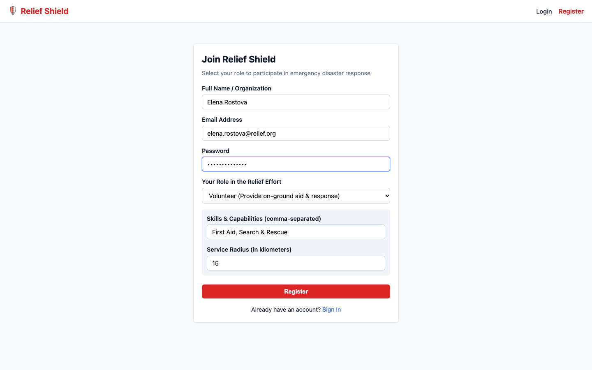
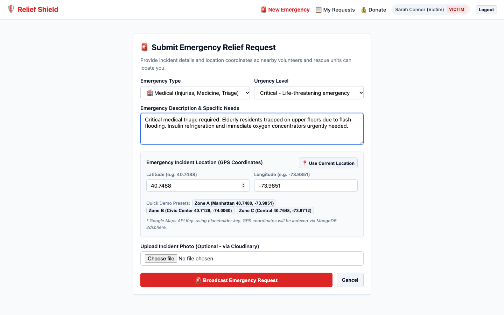
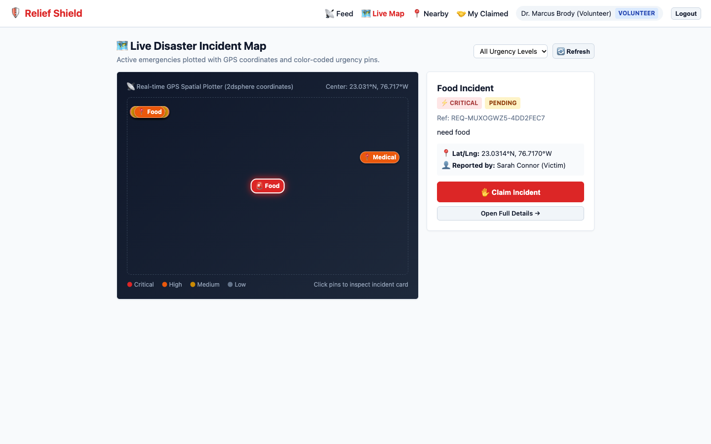
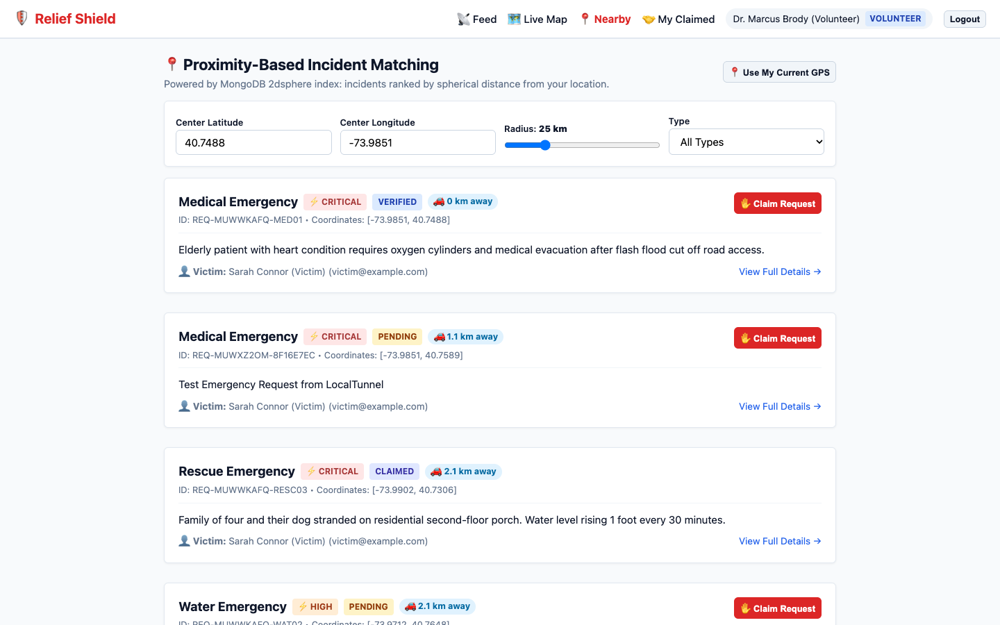
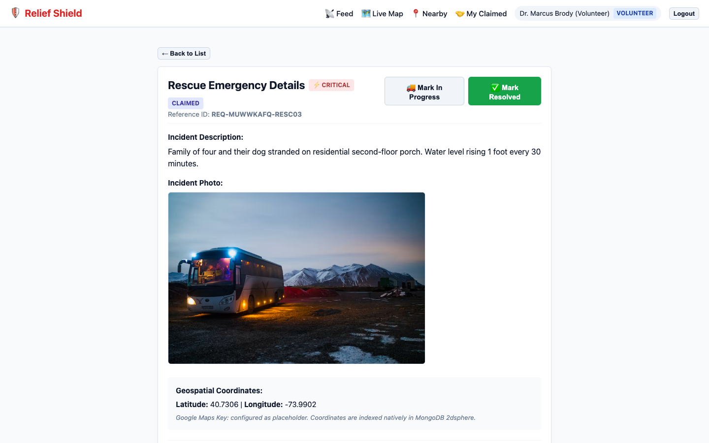
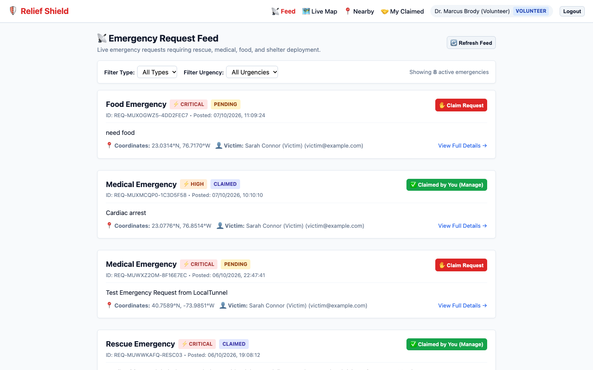
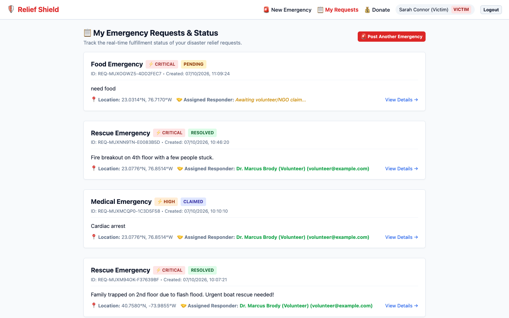
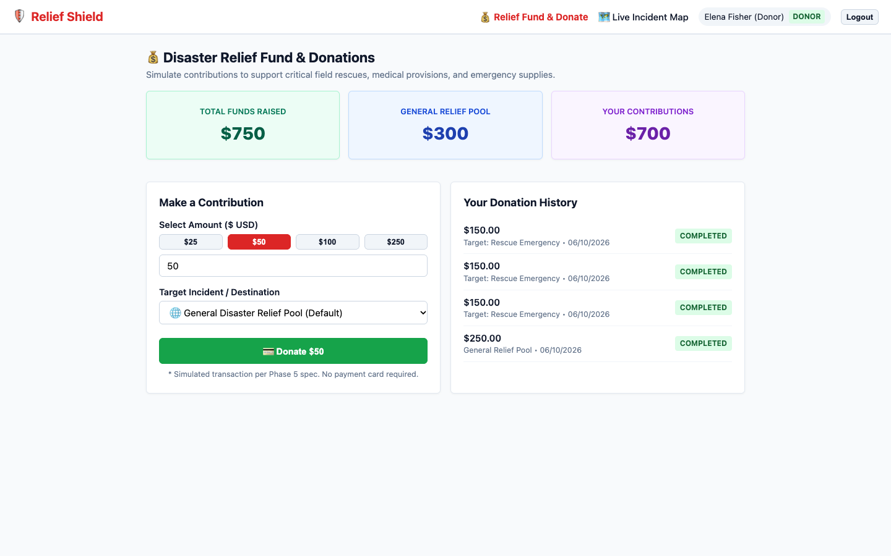
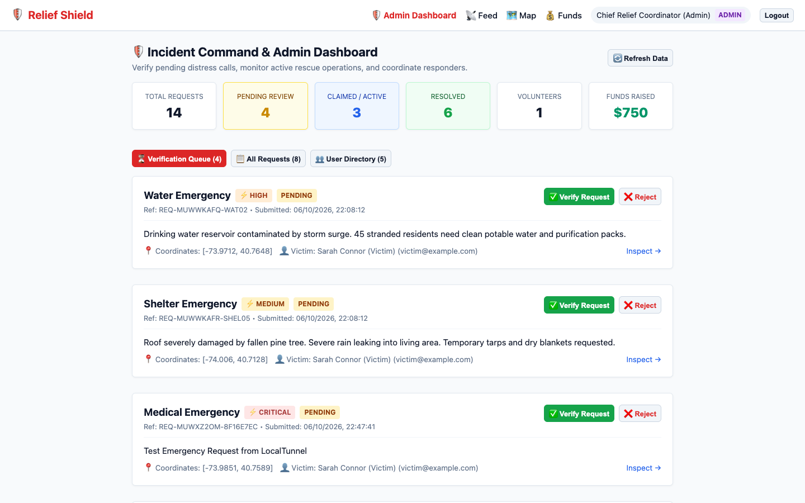

# Relief Shield

## What is Relief Shield

Relief Shield is a web application we built to help coordinate disaster relief in real time. During emergencies like floods, earthquakes, or storms, communication is usually scattered across random WhatsApp groups, social media posts, and phone calls. This makes it really hard to know who actually needs help, what supplies are needed, or where volunteers should go. There is also no central way to verify requests, so people often end up duplicating efforts in one area while other victims are completely missed. Relief Shield fixes this by connecting victims directly with nearby volunteers, NGOs, and donors on a single platform.

## Live demo

[Add deployed link here]

You can test the platform using the pre-configured demo accounts on the login page (victim, volunteer, NGO, donor, and admin) with the password `password123`.

## Screenshots

  
Account creation and sign-in page where users select their role (victim, volunteer, NGO, donor, admin) and enter their skills or service radius.

  
Emergency reporting form where victims submit their incident type, urgency level, description, location coordinates, and optional photos.

  
Real-time map showing active emergency requests color-coded by urgency level with quick inspection cards.

  
Proximity matching list that calculates distance in kilometers from the responder so volunteers can help people closest to them.

  
Full detail view of an emergency request showing photo evidence, victim contact info, coordinates, and current status.

  
Emergency feed where volunteers and NGOs can claim open requests so everyone knows someone is responding.

  
Status tracking page where victims and responders follow requests from pending to claimed, in progress, and resolved.

  
Donation page where donors can contribute to the general relief fund or toward specific emergency requests.

  
Admin control panel with relief stats, a verification queue to approve or reject distress calls, and user management.

## What it does

Here is how the basic flow works in the app:

1. A person affected by a disaster submits an emergency request with the type of emergency, urgency level, description, and their GPS location.
2. Nearby volunteers and NGOs see the request on their feed or on the live map and can claim it so other responders know it is being handled.
3. The victim tracks the request in real time as the volunteer updates the status from pending to claimed, in progress, and resolved.
4. Donors can view the platform and contribute money to support the overall relief effort or back a specific emergency ticket.
5. Administrators oversee the whole system, verify requests to prevent spam, and track response statistics.

## Tech stack and why

- React — lets us build a fast single-page frontend where screens update smoothly without full page reloads.
- Node.js and Express — runs the backend server and handles the API routes for auth, requests, and donations.
- MongoDB — stores users and incident data, and uses geospatial indexing to search requests by location so we can find nearby help.
- Socket.IO — sends real-time updates to connected users the moment an emergency is created, claimed, or resolved.
- Google Maps API — displays the interactive map and drops pins for each incident location.
- JWT and bcrypt — handles user login securely with encrypted password hashing and tokens.
- Cloudinary — stores photos uploaded with emergency requests so we do not have to store large image files directly in the database.

## How to run it locally

1. Clone this repository:
   ```bash
   git clone https://github.com/saumyapant-dev/relief-shield.git
   cd relief-shield
   ```

2. Install dependencies for the server and client:
   ```bash
   npm run install:all
   ```

3. Set up environment files:
   - Copy server/.env.example to server/.env
   - Copy client/.env.example to client/.env
   (Default values are already set up for local development)

4. Start the backend:
   ```bash
   npm run server
   ```

5. In another terminal, start the frontend:
   ```bash
   npm run client
   ```

6. Open http://localhost:5173 in your browser. You can click the one-click demo buttons on the login screen to test each user role.

---
Made for [course name], [college name]
